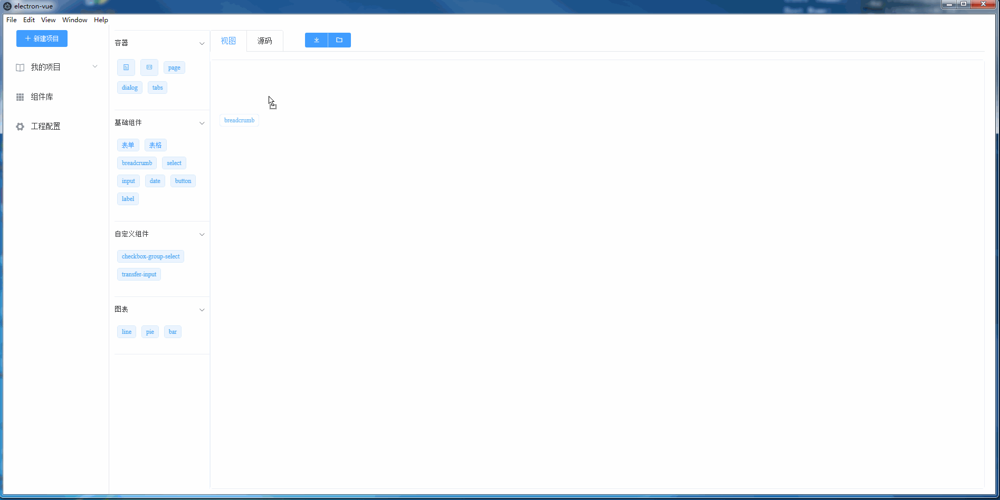

## 简介
该工程是为了实现图形化界面拖拽生成单个vue文件或vue工程，探索快速实现vue管理页面的解决方案。
该工程主要由3个部分组成：画布、代码生成器、组件集。
### 画布（painter)
主要职责为支持图形化界面拖拽的形式生成对应的页面，进而获取对应的json数据结构。

### 代码生成器（generator)
主要职责为通过json数据结构生成单个vue文件或者整个vue工程。

## 执行
```
npm run electron:serve
```
